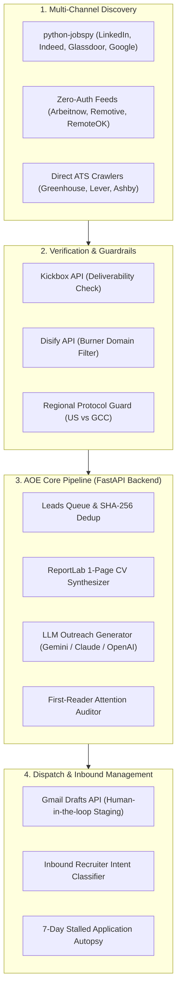

<div align="center">

# ⚡ AOE — Autonomous Outreach Engine

### *Autonomous AI Job Application Co-Pilot, 1-Page Resume Synthesizer & High-Conversion Outreach Pipeline*

[](https://github.com/lordpardonme/aoe/actions/workflows/ci.yml)
[](https://www.python.org/)
[](https://fastapi.tiangolo.com/)
[](https://opensource.org/licenses/MIT)
[](https://codespaces.new/lordpardonme/aoe)
[](#-safety--security-architecture)
[](CONTRIBUTING.md)

<p align="center">
  <a href="#-key-capabilities">Key Features</a> •
  <a href="#-system-architecture">Architecture</a> •
  <a href="#-quick-start">Quick Start</a> •
  <a href="#-multi-environment-orbits">Environment Orbits</a> •
  <a href="#-api-reference">API Reference</a> •
  <a href="#-safety--security-architecture">Security & Privacy</a> •
  <a href="#-contributing">Contributing</a>
</p>

---

</div>

## 📌 What is AOE?

**AOE (Autonomous Outreach Engine)** is a local-first, privacy-preserving AI co-pilot and automated career infrastructure designed for high-conversion job search workflows.

Instead of generic mass spamming, AOE unifies **multi-source discovery, live deliverability verification, strict 1-page layout budgeting, conversational cold pitches, and inbound recruiter intent classification** into an integrated offline workstation.

> 🔒 **100% Local-First & Sovereign:** All databases, credentials, resumes, and telemetry remain strictly on your local machine (`jobhunt.db`). Zero telemetry or personal career history is dispatched to third-party clouds.

---

## ✨ Key Capabilities

<table>
  <tr>
    <td width="50%">
      <h3>🎯 Leads Queue Hub & Scraper Engine</h3>
      <ul>
        <li>Aggregated multi-board discovery via <b>python-jobspy</b> (LinkedIn, Indeed, Glassdoor, Google Jobs, ZipRecruiter, Bayt).</li>
        <li>Zero-auth live feeds from <b>Arbeitnow, Remotive, RemoteOK, and freehire</b>.</li>
        <li>SHA-256 deduplication and 72-hour freshness windowing.</li>
        <li>590+ verified target leads categorized into Direct Employers, YC Startups, Agencies, and Social Leads.</li>
      </ul>
    </td>
    <td width="50%">
      <h3>⚡ Autonomous Batch Tailoring Engine</h3>
      <ul>
        <li>Select 10–50 leads in the UI to launch automated batch tailoring pipelines.</li>
        <li>Direct integration with <b>Gmail Drafts API</b> (saves directly to <code>mail.google.com/mail/#drafts</code> for 1-click human review).</li>
        <li>Dry-run preview mode with execution metrics and runtime logs.</li>
      </ul>
    </td>
  </tr>
  <tr>
    <td width="50%">
      <h3>📄 Strict 1-Page Layout Synthesizer</h3>
      <ul>
        <li>Enforces pixel-budgeted single-page PDF output using <b>ReportLab</b>.</li>
        <li>Automated vertical spacing, typographic hierarchy, and Bahnschrift font metrics.</li>
        <li>Verified WCAG AA color contrast and ATS-friendly semantic structure.</li>
        <li><b>Zero-overflow guarantee:</b> strictly eliminates trailing second pages.</li>
      </ul>
    </td>
    <td width="50%">
      <h3>🌍 Regional Hiring Protocol Guard</h3>
      <ul>
        <li>Dynamic regional compliance powered by REST Countries metadata.</li>
        <li><b>US / Canada / UK:</b> strictly no-photo, privacy-compliant ATS format.</li>
        <li><b>UAE / Saudi Arabia / GCC:</b> automated photo inclusion, transferable visa status, and nationality declaration.</li>
      </ul>
    </td>
  </tr>
  <tr>
    <td width="50%">
      <h3>🔍 Zero-Auth Deliverability Verification</h3>
      <ul>
        <li><b>Kickbox Open API:</b> Real-time deliverability syntax and MX record validation.</li>
        <li><b>Disify API:</b> Automated disposable/burner domain filtering.</li>
        <li><b>Frankfurter API:</b> European Central Bank exchange rates for salary normalization across USD, EUR, GBP, AED, and INR.</li>
      </ul>
    </td>
    <td width="50%">
      <h3>📬 Smart Follow-Up & Inbound Scanner</h3>
      <ul>
        <li><b>7-Day Follow-Up Automation:</b> Detects pending applications &ge; 7 days old with zero response and crafts punchy 2-sentence conversion hooks.</li>
        <li><b>Inbound Scanner:</b> Analyzes recruiter responses via Gmail API, auto-classifying into <i>Interview</i>, <i>Assessment</i>, <i>Review</i>, or <i>Rejection</i>.</li>
      </ul>
    </td>
  </tr>
</table>

---

## 🏗 System Architecture



---

## 🚀 Quick Start

### 1. Clone & Setup

```bash
# Clone the repository
git clone https://github.com/lordpardonme/aoe.git
cd aoe

# Setup Python 3.11 virtual environment
cd job-agent
python -m venv .venv

# Activate environment
# On Windows:
.venv\Scripts\activate
# On Linux/macOS:
source .venv/bin/activate

# Install dependencies
pip install -r requirements.txt
pip install fastapi uvicorn reportlab pandas pyyaml requests httpx pydantic pydantic-settings
```

### 2. Launch the Application

```bash
# Return to root directory
cd ..

# Start AOE in Production Orbit (Port 8000)
python run_app.py

# Or launch with custom environment flags:
python run_app.py --env uat          # Port 8001 (Isolated Test DB)
python run_app.py --env staging      # Port 8002 (Pre-Prod Staging)
python run_app.py --no-browser       # Headless / Server mode
```

Access the web interface at **`http://127.0.0.1:8000`**.

---

## 🌐 One-Click Cloud Dev (GitHub Codespaces)

You can launch a full-stack, pre-configured AOE workstation in your browser with zero local installation:

[](https://codespaces.new/lordpardonme/aoe)

* Pre-configured with Python 3.11, Node.js LTS, Ruff linter, and Tailwind extensions.
* Automatic port forwarding for **Port 8000** (Production), **8001** (UAT), and **8002** (Staging).

---

## 🛰 Multi-Environment Orbits

AOE features isolated database and runtime orbits to ensure experimental tests never pollute production application records:

| Orbit | Port | Database Target | Safe Mode (`DRY_RUN`) | Purpose |
|---|---|---|---|---|
| **`UAT`** | `8001` | `tracker/jobhunt_uat.db` | `True` | Rapid experimentation, synthetic leads, UI regression testing |
| **`Staging`** | `8002` | `tracker/jobhunt_staging.db` | `True` | Pre-production validation and batch dispatch dry-runs |
| **`Production`** | `8000` | `tracker/jobhunt.db` | `True` (default) | Verified production queue and authenticated Gmail staging |

### Environment CLI Manager (`manage_env.py`)

Manage and inspect your runtime environments with a single command:

```bash
# View current active environment and database telemetry
python manage_env.py status

# Switch local environment
python manage_env.py switch uat
python manage_env.py switch staging
python manage_env.py switch production

# Run automated verification test suite
python manage_env.py test

# Promote changes from UAT -> Staging or Staging -> Production
python manage_env.py promote --from-env staging --to-env production
```

---

## ⚙️ Configuration & Environment Variables

Copy `.env.example` to `.env` to configure optional integrations:

```bash
cp job-agent/.env.example job-agent/.env
```

| Key | Type | Default | Description |
|---|---|---|---|
| `APP_ENV` | String | `production` | Active runtime environment (`uat`, `staging`, `production`) |
| `DRY_RUN` | Boolean | `true` | When `true`, prevents live email dispatches and enforces safe draft staging |
| `ACTIVATION_PASSKEY` | String | `""` | Optional passkey required to execute live external dispatches |
| `LLM_PROVIDER` | String | `gemini` | Primary AI provider (`gemini`, `openai`, `claude`) |
| `LLM_API_KEY` | String | `""` | API key for the selected LLM provider |
| `SENDER_EMAIL` | String | `""` | Authorized sender email address for Gmail OAuth |

---

## 📡 API Reference

AOE exposes a comprehensive RESTful API built with FastAPI. Interactive Swagger documentation is automatically available at:

* **Swagger UI:** `http://127.0.0.1:8000/docs`
* **ReDoc:** `http://127.0.0.1:8000/redoc`

### Core Endpoints

| Category | Method | Endpoint | Description |
|---|---|---|---|
| **System** | `GET` | `/api/config` | Retrieve current orbit environment, dry-run state, and version |
| **Leads** | `GET` | `/api/leads` | Query filtered leads queue with pagination and source filters |
| **Leads** | `POST` | `/api/leads/batch` | Ingest new batch of leads into the relational database |
| **Scraper** | `POST` | `/api/scraper/trigger` | Trigger async JobSpy scraping run (Express or Comprehensive) |
| **Scraper** | `GET` | `/api/scraper/status` | Poll scraping progress, lead counts, and worker status |
| **Verification** | `POST` | `/api/verify/email` | Verify email syntax, MX records, and burner status |
| **CV Engine** | `POST` | `/api/resume/render` | Synthesize tailored 1-page PDF resume from candidate profile |
| **Outreach** | `POST` | `/api/drafts/create` | Generate customized outreach email and stage to Gmail Drafts |
| **Analytics** | `GET` | `/api/tracker/stats` | Pipeline metrics (sent, pending, interview rate, response times) |
| **Auditor** | `POST` | `/api/first-reader/audit` | Attention scoring and cognitive load audit of pitch drafts |

---

## 🔒 Safety & Security Architecture

AOE is engineered with defense-in-depth principles for high-stakes career management:

* **Strict Safe-by-Default:** `DRY_RUN=True` is hardcoded as the default state across all environments. External email dispatches are physically blocked unless explicitly toggled off.
* **Dual Protection Layers:** Live email dispatches require both `DRY_RUN=False` AND verification of an optional `ACTIVATION_PASSKEY`.
* **Zero Cloud Leakage:** Resumes, profile evidence, and SQLite databases are strictly excluded via `.gitignore`.
* **Protected Branch Rules:** Direct pushes to `main` and `staging` are blocked. All modifications require Pull Requests with owner approval and automated CI checks.
* **Tag Protection:** Version tags (`v*.*.*`) are immutable and protected against deletion or modification.

---

## 🤝 Contributing & Governance

We welcome contributions from the community! Please read our [Contributing Guidelines](CONTRIBUTING.md) and [Code of Conduct](CODE_OF_CONDUCT.md) before submitting pull requests.

### Contribution Workflow

1. Fork the repo and create a feature branch (`git checkout -b feature/amazing-feature staging`).
2. Adhere to **PEP 8** standards and verify syntax using `python -m py_compile`.
3. Submit a Pull Request targeting the **`staging`** branch.
4. Ensure all automated GitHub Actions CI quality gates pass.
5. All PRs are reviewed and approved via [CODEOWNERS](.github/CODEOWNERS).

---

## 📄 License

Distributed under the **MIT License**. See [`LICENSE`](LICENSE) for complete terms.

---

<div align="center">
  <sub>Built with ❤️ by <a href="https://github.com/lordpardonme">lordpardonme</a> • Autonomous Career Infrastructure</sub>
</div>
